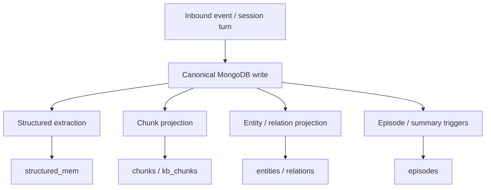
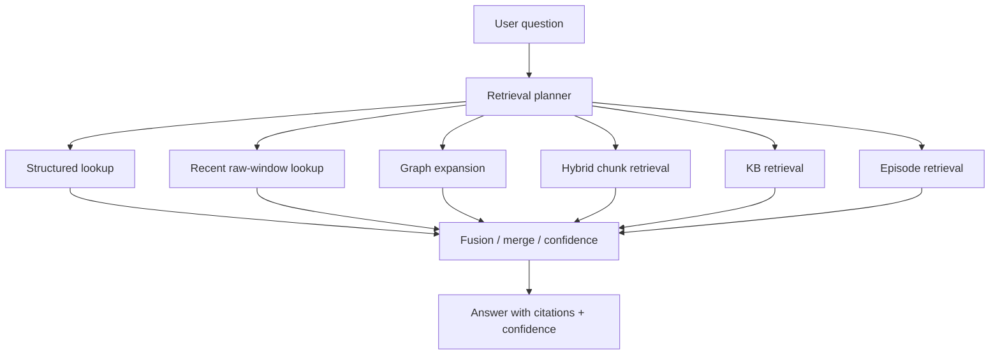

# ClawMongo MongoDB Memory Blueprint

This document captures the target architecture for ClawMongo as a MongoDB-first
fork of OpenClaw.

It folds together:

- the current ClawMongo implementation
- lessons learned from production-hardening a real ClawMongo-based deployment
- official MongoDB capabilities and operating guidance
- useful ideas from agent-memory systems such as Mem0 and Cognee, translated
  into a MongoDB-only architecture
- useful ideas from the earlier
  [Hybrid-Search-RAG](https://github.com/romiluz13/Hybrid-Search-RAG) project

This is not a plugin comparison doc. It is the architecture statement for how
ClawMongo should think about memory.

## North Star

ClawMongo should make MongoDB the one and only runtime memory layer for
OpenClaw-compatible agents.

That means:

- one canonical source of truth
- one operational model
- one retrieval model
- one health model
- one story for single-agent and multi-agent systems

Markdown still matters, but as human-authored guidance and operator content, not
as a shadow runtime database.

## Non-Negotiable Principles

1. MongoDB is the canonical runtime memory store.
2. Markdown workspace files remain prompt/bootstrap/operator files, not the live
   runtime memory backend.
3. Derived views are allowed. Shadow sources of truth are not.
4. Search, graph, summaries, and structured memory are all derived capabilities
   over canonical MongoDB data.
5. ClawMongo stays MongoDB-only. No Neo4j, no Qdrant, no external graph DB, no
   alternate vector DB, no SQLite fallback.
6. Failure in `mongot` or retrieval quality must degrade recall, not erase
   memory truth.

## What ClawMongo Should Mean

ClawMongo is not "OpenClaw plus another memory plugin."

ClawMongo should be:

- OpenClaw-compatible agent runtime
- MongoDB-native memory substrate
- MongoDB Community + `mongod` + `mongot` as the official runtime shape
- hybrid retrieval, structured memory, graph projection, and episodic memory
  all implemented inside MongoDB

The correct framing is not "which memory backend should users choose?"

The correct framing is:

ClawMongo provides a single MongoDB-native memory architecture that can support:

- single-user assistants
- multi-agent orchestrations
- RAG-style knowledge assistants
- long-running conversational systems
- operational bots in real messaging channels

## Lessons From Production Hardening

ClawMongo already proved useful in a demanding real deployment. The important
thing is not the specific product personality of that deployment. The important
thing is the framework lesson that became visible under real load, real data,
real retrieval drift, and real operational failure modes.

### 1. Canonical truth and export views must be separated

Any system that needs human-readable logs, summaries, reports, audit files, or
portable exports will be tempted to let those artifacts become semi-canonical.
That is a mistake.

Generalized ClawMongo lesson:

- raw truth must live in canonical MongoDB collections
- summaries may use a derived ordered raw export view
- exports must never become the real ingest source in steady state

### 2. Health is multi-layered

Real operation exposed a critical distinction between:

- canonical ingest health
- search / `mongot` health
- export freshness
- product-surface delivery health

These cannot be collapsed into one "memory healthy" bit.

Generalized ClawMongo lesson:

Every memory-aware system should report at least:

- canonical write path health
- retrieval path health
- projection/materialization health
- backup freshness
- topology / HA posture

### 3. Source-policy leaks are dangerous

One of the most important ClawMongo review findings is that MongoDB memory still
has traces of earlier assumptions about session memory and source selection.

Generalized lesson:

- source policy must be explicit
- per-agent source policy must be enforced end to end
- retrieval manager caches must respect policy changes
- a framework must never silently widen recall scope

### 4. Summaries and state reports need raw truth, not snippet-only recall

The issue is not that MongoDB retrieval is weak. The issue is that some product
capabilities are not retrieval problems at all. They are exact-window,
ordered-event, or raw-state problems.

Generalized lesson:

- normal recall should use hybrid retrieval
- summaries should read ordered raw canonical records for an exact time window
- summaries should not be built from vector hits alone

### 5. Operational discipline matters as much as schema

The deployment became much more trustworthy once it had:

- release gates
- backups
- `mongot` watchdogs
- audit scripts
- explicit degraded-mode reasoning

Generalized lesson:

MongoDB-first architecture is not just collections and queries. It is also:

- observability
- fail-safe operations
- repeatable deploys
- explicit degradation behavior

## What To Learn From Mem0 and Cognee

Do not use them as dependencies. Learn from the patterns.

### Mem0 ideas worth absorbing

- automatic memory extraction after turns
- scoped memory such as session versus long-term user memory
- explicit remember / forget flows
- memory as durable structured facts, not only retrieved chunks

ClawMongo translation:

- auto-extract facts, decisions, preferences, todos, and profiles into
  `structured_memory`
- scope memory by `session`, `agent`, `user`, `workspace`, and optional
  `tenant`
- keep all stored memory in MongoDB collections

### Cognee ideas worth absorbing

- entity-first modeling
- relation extraction
- graph-aware retrieval and reasoning
- episodic / entity / relation separation

ClawMongo translation:

- derive `entities` and `relations` collections from canonical events
- use MongoDB aggregations and [`$graphLookup`](https://www.mongodb.com/docs/manual/reference/operator/aggregation/graphlookup/)
  for graph-aware traversals
- keep graph as a derived projection, not a separate backend

### What not to copy

- separate graph databases
- separate vector databases
- memory systems that become more canonical than the application event log

Absorb the patterns, not the products.

## What To Learn From Hybrid-Search-RAG

Useful ideas from the earlier project:

- one-database architecture
- hybrid retrieval as the default, not a special case
- score visibility and debugging
- graph as a value-add, not a second truth system
- self-compacting episodic memory

What not to copy literally:

- "one huge document owns everything"

For agent memory, the more Mongo-correct shape is:

- bounded canonical documents
- derived retrieval documents
- derived graph documents
- derived summary documents

## Canonical ClawMongo Data Model

This is the target memory model.

### 1. Canonical event collections

These are the ground truth.

- `messages` or `events`
  - one inbound or outbound conversational event per document
  - includes channel/session/agent/user/timestamp/body/metadata
- `knowledge_base`
  - imported reference documents
- `kb_documents`
  - optional normalized document metadata if needed separately from chunks

These collections are durable truth, not search-only projections.

### 2. Retrieval collections

These are derived from canonical truth.

- `chunks`
  - retrieval projection over messages/events
- `kb_chunks`
  - retrieval projection over imported docs
- `structured_memory`
  - explicit durable facts and observations

These collections serve `memory_search`, `memory_get`, `kb_search`, and
`memory_write`.

### 3. Graph projection collections

These are optional but first-class.

- `entities`
  - people, projects, teams, features, customers, topics, tools
- `relations`
  - edges such as `works_on`, `depends_on`, `decided`, `mentioned_with`,
    `blocked_by`, `owner_of`

These must be derived from canonical truth and rebuildable.

### 4. Episodic memory collections

- `episodes`
  - daily summaries
  - thread summaries
  - topic summaries
  - major decision summaries

Episodes are compressed memory. They must never replace raw truth.

### 5. Operational collections

- `ingest_runs`
- `relevance_runs`
- `relevance_artifacts`
- `relevance_regressions`
- `projection_runs`
- `backup_manifests`

These let ClawMongo explain itself.

## Core Memory Capabilities To Leverage In MongoDB

ClawMongo should lean into the features MongoDB already gives it.

### Schema validation

Use JSON Schema validation to enforce structure on canonical and derived memory
collections.

Official docs:

- [Schema validation](https://www.mongodb.com/docs/manual/core/schema-validation/)

Use this for:

- canonical message/event shape
- structured memory record types
- entity/relation shape
- episode schema consistency

### Change Streams

Use change streams to drive incremental projections from canonical collections
to derived collections.

Official docs:

- [Change Streams](https://www.mongodb.com/docs/manual/changestreams/)

Use this for:

- chunk projection refresh
- structured extraction jobs
- entity/relation projection
- episode materialization triggers

### Transactions

Use transactions only where a business invariant truly spans multiple
collections.

Official docs:

- [Transactions](https://www.mongodb.com/docs/manual/core/transactions/)

Use transactions sparingly for:

- atomic writes where a raw event and a strict side table must appear together
- idempotent promotion of extracted memory when duplicate creation is unsafe

Do not make every projection path transactional by default.

### Search, Vector Search, and Fusion

ClawMongo should use lexical + vector + fusion as its primary recall engine.

Official docs:

- [Search in Community deployment](https://www.mongodb.com/docs/manual/core/search-in-community/deploy-rs-keyfile-mongot/)
- [Configuration options for `mongot`](https://www.mongodb.com/docs/manual/reference/configuration-options/)
- [`$rankFusion`](https://www.mongodb.com/docs/manual/reference/operator/aggregation/rankFusion/)
- [`$scoreFusion`](https://www.mongodb.com/docs/manual/reference/operator/aggregation/scoreFusion/)

Use this for:

- hybrid recall over chunks
- exact keyword recall when lexical is stronger
- semantic recall when wording drifts
- explainable fallback paths

### Automated embeddings

ClawMongo should keep server-managed automated embeddings as the default official
path.

That keeps the app layer simpler and reinforces the MongoDB-native story.

### TTL indexes

Use TTL selectively for:

- embedding cache
- ephemeral operational telemetry
- non-critical short-term derived data

Do not TTL canonical truth collections unless the product explicitly wants data
lifecycle expiration.

### `$graphLookup`

Use MongoDB itself for graph-style traversal over derived `entities` and
`relations`.

Official docs:

- [`$graphLookup`](https://www.mongodb.com/docs/manual/reference/operator/aggregation/graphlookup/)

This is how ClawMongo gets graph capability without introducing a graph DB.

## Retrieval Planner

ClawMongo should not think of retrieval as "search chunks and hope."

It should have an explicit planner.

### Proposed retrieval order

1. structured lookup
   - decisions
   - preferences
   - people/project facts
   - explicit memory writes
2. recent raw-event window
   - when the question is recent, time-bounded, or summary-like
3. graph expansion
   - entities and relations around the main topic
4. hybrid chunk retrieval
   - lexical + vector + fusion
5. KB-focused retrieval
   - imported docs and reference knowledge
6. episodic memory
   - compact summaries when the question is broad or historical

The planner should choose the cheapest path that matches the question shape.

### Retrieval confidence

Every retrieval should be able to say:

- which path was used
- whether fusion degraded
- whether only lexical fallback was available
- whether the answer is low confidence

This should be part of ClawMongo's memory API, not just logs.

## Memory Scopes

ClawMongo should support explicit scope without external memory systems.

### Recommended scopes

- `session`
- `user`
- `agent`
- `workspace`
- `tenant`
- `global`

Examples:

- "Rom prefers approval drafts before group sends" -> `user`
- "Current coding turn discussed branch sync details" -> `session`
- "This support agent only handles billing" -> `agent`
- "Workspace conventions for this codebase" -> `workspace`

Scope should be a first-class indexable field, not an implied convention.

## Summaries and Episodes

Summaries should be built from raw canonical records, not from top-k retrieval
results.

### Rule

- summaries read ordered raw truth for the exact window
- episodes are derived documents stored back into MongoDB
- Markdown export is optional and human-facing

For ClawMongo generally:

- daily summary
- weekly summary
- thread summary
- project / topic summary
- "decision since X" summary

These become reusable memory layers and not one-off prompts.

## Structured Memory

`memory_write` should not be treated as a side feature.
It is the durable memory API.

### Recommended structured types

- `decision`
- `preference`
- `fact`
- `todo`
- `person`
- `project`
- `architecture`
- `constraint`
- `contact`
- `relationship`

Every structured record should include:

- type
- key
- value
- scope
- agentId or workspaceId
- provenance
- confidence
- updatedAt
- source event locator(s)

That gives ClawMongo Mem0-like power without leaving MongoDB.

## Graph Projection

Graph should be derived, scoped, and queryable.

### Entity examples

- person
- org
- customer
- project
- issue
- feature
- topic
- document

### Relation examples

- `works_on`
- `owns`
- `depends_on`
- `blocked_by`
- `decided`
- `mentioned_with`
- `reported_by`
- `related_to`

### Rules

- entities and relations are derived from canonical truth plus structured memory
- graph projection is rebuildable
- graph writes do not outrank source truth
- graph retrieval is an augmentation path, not the only path

## Markdown Ownership Contract

Keep the boundary simple.

### Markdown keeps ownership of

- `AGENTS.md`
- `SOUL.md`
- `TOOLS.md`
- `IDENTITY.md`
- `USER.md`
- `HEARTBEAT.md`
- `BOOTSTRAP.md`
- `MEMORY.md`
- human-authored operator notes
- scratch notes and journals

### MongoDB keeps ownership of

- canonical runtime memory
- structured memory
- retrieval projections
- KB ingestion
- graph projection
- episodes
- operational retrieval telemetry

### Important rule

Do not let exported `.md` files become the live runtime truth again.

## Operational Model

ClawMongo should ship with a first-class MongoDB ops posture.

### What every production install should know

- topology state
- writable primary state
- backup freshness
- `mongot` health
- search index readiness
- latest canonical write freshness
- projection lag
- relevance / retrieval health

### Required operational surfaces

- MongoDB ops status command
- MongoDB ops audit command
- backup create / verify workflow
- `mongot` watchdog
- release gate that includes memory health

### Deployment truth

For real HA, MongoDB's official guidance is replica-set based:

- [Replica Set Architectures](https://www.mongodb.com/docs/manual/core/replica-set-architectures/)

Single-node replica sets are acceptable for local and simple VPS operation, but
they are not node-loss HA.

## Degradation Rules

This is critical.

### If `mongot` is degraded

- canonical writes continue
- structured memory writes continue
- summaries and episodes still work from raw truth
- retrieval falls back to lexical or exact structured/raw paths
- health status becomes degraded-runtime, not broken-memory

### If change streams are unavailable

- periodic sync/materialization continues
- health reflects reduced freshness guarantees
- truth remains canonical in MongoDB

### If projection jobs fail

- canonical truth remains usable
- rebuild path exists
- the system reports lag explicitly

## What ClawMongo Already Has

Today ClawMongo already has the right foundations:

- MongoDB-only backend contract
- Community + `mongot` official deployment posture
- automated embeddings
- hybrid retrieval
- structured memory
- relevance telemetry
- change-stream support
- schema validation

Those are strong foundations.

## What ClawMongo Should Improve Next

These are the most important framework-level improvements.

### 1. Enforce source policy end to end

The retrieval manager and cache must fully respect per-agent source policy.

That means:

- no implicit widening of sources
- no hidden auto-enabling of session memory
- cache keys must reflect source/scope policy
- status output must reflect real active sources

### 2. Promote raw canonical event collections as the formal center

Make the canonical event model more explicit in docs and code, rather than
letting retrieval projections feel like the main data model.

### 3. Add first-class episode materialization

Daily / weekly / topic summaries should be a formal subsystem.

### 4. Add graph projection as a Mongo-native optional subsystem

Not because graph is trendy, but because relational memory is genuinely useful
for agents.

### 5. Ship MongoDB ops as part of ClawMongo core

The operational hardening already proven in a production deployment should be
generalized into ClawMongo itself.

### 6. Tighten the product contract

If Community + `mongot` + automated embeddings is the official path, docs,
wizard behavior, and health surfaces should reflect that unambiguously.

### 7. Add true end-to-end memory tests

For a framework, unit tests are not enough.

ClawMongo should have end-to-end tests for:

- inbound event -> canonical write -> chunk projection -> retrieval
- structured extraction -> memory_write -> later recall
- raw window -> episode materialization
- degraded `mongot` -> lexical/structured/raw fallback

## Recommended Collection Families

This is the simplest useful target set.

```text
openclaw_<agent>_events
openclaw_<agent>_chunks
openclaw_<agent>_knowledge_base
openclaw_<agent>_kb_chunks
openclaw_<agent>_structured_mem
openclaw_<agent>_entities
openclaw_<agent>_relations
openclaw_<agent>_episodes
openclaw_<agent>_ingest_runs
openclaw_<agent>_projection_runs
openclaw_<agent>_relevance_runs
openclaw_<agent>_relevance_artifacts
openclaw_<agent>_relevance_regressions
openclaw_<agent>_meta
```

## Target Write Pipeline



## Target Retrieval Pipeline



## What ClawMongo Should Never Become

- a plugin zoo of competing memory backends
- a Mongo wrapper that secretly falls back to file memory
- a multi-database orchestration story
- a system where projections outrank canonical truth
- a framework where retrieval scope silently changes underneath operators

## Practical Product Statement

ClawMongo should be able to say this plainly:

ClawMongo uses MongoDB Community as the one and only runtime memory layer for
OpenClaw-compatible agents.

It stores canonical events, structured memory, retrieval projections, graph
projections, and episodic summaries in MongoDB.

It uses Search, Vector Search, automated embeddings, fusion, change streams,
schema validation, and transactions where they materially improve agent memory.

It does not require or recommend any competing memory database.

## Web Research Sources

Official MongoDB docs and pages used in the reasoning for this blueprint:

- [Schema validation](https://www.mongodb.com/docs/manual/core/schema-validation/)
- [Change Streams](https://www.mongodb.com/docs/manual/changestreams/)
- [Transactions](https://www.mongodb.com/docs/manual/core/transactions/)
- [Replica Set Architectures](https://www.mongodb.com/docs/manual/core/replica-set-architectures/)
- [Search in Community deployment](https://www.mongodb.com/docs/manual/core/search-in-community/deploy-rs-keyfile-mongot/)
- [Configuration options for `mongot`](https://www.mongodb.com/docs/manual/reference/configuration-options/)
- [`$graphLookup`](https://www.mongodb.com/docs/manual/reference/operator/aggregation/graphlookup/)
- [`$rankFusion`](https://www.mongodb.com/docs/manual/reference/operator/aggregation/rankFusion/)
- [`$scoreFusion`](https://www.mongodb.com/docs/manual/reference/operator/aggregation/scoreFusion/)
- [MongoDB Community Search public preview update](https://www.mongodb.com/products/updates/public-preview-mongodb-community-edition-now-offers-native-full-text-and-vector-search/)
- [MongoDB automated embedding public preview update](https://www.mongodb.com/products/updates/now-in-public-preview-automated-embedding-in-vector-search-in-community-edition)

Agent-memory pattern sources consulted for idea translation, not dependency
recommendation:

- [Mem0 OpenClaw integration docs](https://docs.mem0.ai/integrations/openclaw)
- [Mem0 graph memory docs](https://docs.mem0.ai/platform/features/graph-memory)
- [Cognee ontologies](https://docs.cognee.ai/core-concepts/data-to-memory/ontologies)
- [Cognee memify](https://docs.cognee.ai/core-concepts/main-operations/memify)
- [Cognee search](https://docs.cognee.ai/core-concepts/main-operations/search)

## Final Position

The best ClawMongo architecture is not:

- QMD
- Mem0
- Cognee
- Neo4j
- Qdrant
- SQLite fallback

The best ClawMongo architecture is:

- MongoDB as canonical truth
- MongoDB as retrieval substrate
- MongoDB as structured memory store
- MongoDB as graph projection store
- MongoDB as episodic memory store
- MongoDB as the operational truth surface

That is the strongest, cleanest, and most defensible MongoDB-native memory
story for OpenClaw.
