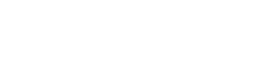

# ClawMongo -- The MongoDB Edition of OpenClaw

<p align="center">
  
</p>

<p align="center">
  <a href="https://github.com/romiluz13/ClawMongo/actions/workflows/ci.yml?branch=main"></a>
  <a href="https://github.com/romiluz13/ClawMongo/releases"></a>
  <a href="https://discord.gg/clawd"></a>
  <a href="LICENSE"></a>
</p>

ClawMongo is [OpenClaw](https://github.com/openclaw/openclaw) (329K stars, 22 messaging channels, native apps on macOS/iOS/Android, 78 extensions) with its memory system replaced by a production-grade MongoDB backend. Where OpenClaw defaults to QMD (SQLite + Markdown), ClawMongo uses MongoDB Community + mongot + Voyage AI to deliver vector search, knowledge graphs, episode materialization, event-sourcing, and 8 retrieval paths -- all inside a single database.

[ClawMongo Repo](https://github.com/romiluz13/ClawMongo) |
[Getting Started](docs/start/clawmongo-getting-started.md) |
[MongoDB Capabilities](docs/reference/mongodb-capabilities.md) |
[vs Default Memory](docs/reference/clawmongo-vs-default-memory.md) |
[OpenClaw Docs](https://docs.openclaw.ai) |
[Discord](https://discord.gg/clawd)

---

## What Is ClawMongo?

Like Ubuntu is to Linux, ClawMongo is the MongoDB edition of OpenClaw. You get the full OpenClaw personal AI assistant -- 22 messaging channels (WhatsApp, Telegram, Slack, Discord, Signal, iMessage, Microsoft Teams, Matrix, and 14 more), 78 extensions (25+ LLM providers, tools, media, infra), companion apps for macOS/iOS/Android, voice wake, live canvas, and the entire skills platform -- plus a MongoDB-native memory system that replaces the default SQLite/Markdown backend.

ClawMongo is **not** a memory library. It is a complete personal AI assistant that happens to use MongoDB as its data layer. The product is the assistant. The MongoDB memory is what makes it production-ready.

**Three audiences, in priority order:**

1. **OpenClaw power users** who need retrieval quality, operational visibility, and a real database behind their assistant's memory.
2. **MongoDB developers** who want a personal AI assistant that stores everything in the database they already know and operate.
3. **Production teams** who need schema validation, multi-tenant isolation, change streams, and explain-driven diagnostics on their agent's recall system.

---

## Why MongoDB for Agent Memory?

MongoDB is uniquely suited for agent memory because it combines document flexibility, vector search, full-text search, graph traversal, and operational guarantees in a single platform. No other database offers all of these without bolting on external services.

ClawMongo uses 12 MongoDB capabilities. Each one solves a specific agent memory problem:

| # | Capability | Why It Matters | How It Works |
|---|-----------|----------------|--------------|
| 1 | **Automated Embeddings** | No application-side embedding code, no batch jobs, no model version management | mongot calls Voyage AI API at index time and query time via `autoEmbed` |
| 2 | **Vector Search** | Semantic recall over conversation history and knowledge base | `$vectorSearch` with HNSW indexing on `voyage-4-large` (1024 dimensions) |
| 3 | **Full-Text Search** | Keyword recall when the user asks for exact terms | mongot text indexes with Lucene standard analyzer |
| 4 | **Hybrid Search** | Neither vector nor keyword alone is sufficient for agent memory | `$rankFusion` / `$scoreFusion` (MongoDB 8.0+/8.2+), with manual RRF fallback |
| 5 | **Knowledge Graph** | Agents need to traverse relationships, not just match strings | `$graphLookup` with bi-directional expansion via `$facet` |
| 6 | **Event-Sourcing** | Every write must be auditable and replayable | Canonical `events` collection with derived projections (chunks, entities, episodes) |
| 7 | **Schema Validation** | Garbage in, garbage out -- agent memory must be structurally consistent | JSON Schema (`$jsonSchema`) on all 17 validated collections |
| 8 | **Change Streams** | Multiple gateway instances must stay in sync | Real-time cross-instance notification via MongoDB change streams |
| 9 | **TTL Indexes** | Embedding caches and telemetry data should expire automatically | `expireAfterSeconds` on `embedding_cache`, `relevance_runs`, `relevance_artifacts` |
| 10 | **Multi-Tenant Isolation** | One database, many agents, zero data leakage | Compound indexes with `agentId` prefix + `$graphLookup` `restrictSearchWithMatch` |
| 11 | **Idempotent Upserts** | Network retries and replays must not corrupt memory | `$setOnInsert` for creation-time fields + `$set` for mutable fields on unique compound keys |
| 12 | **Relevance Telemetry** | You cannot improve retrieval quality without measuring it | `explain`-driven diagnostics across `relevance_runs`, `relevance_artifacts`, `relevance_regressions` |

For the full technical deep-dive on each capability with code examples: [MongoDB Capabilities in ClawMongo](docs/reference/mongodb-capabilities.md)

---

## ClawMongo vs Default OpenClaw Memory

| Capability | OpenClaw Default (QMD/SQLite) | ClawMongo (MongoDB) |
|---|---|---|
| Storage backend | SQLite file + Markdown files | MongoDB Community (replica set) |
| Vector search | sqlite-vec or LanceDB | mongot + Voyage AI autoEmbed |
| Embedding management | Application-side (multiple providers) | Automated via mongot (zero app code) |
| Full-text search | SQLite FTS5 / BM25 | mongot text indexes (Lucene) |
| Hybrid search | BM25 + vector with MMR | `$rankFusion` / `$scoreFusion` + RRF |
| Knowledge graph | None | `$graphLookup` with entities + relations |
| Episodes | None | Auto-materialized from event windows |
| Event sourcing | None (append-only Markdown) | Canonical events collection |
| Structured memory | Basic key-value | Salience, temporal validity, state, provenance |
| Procedures | None | Versioned workflow artifacts |
| Retrieval paths | 1 (search) | 8 paths with planner-driven selection |
| Schema validation | None | JSON Schema on all collections |
| Multi-tenant isolation | Filesystem separation | Compound indexes with agentId prefix |
| Operational visibility | Limited | Ingest runs, projection runs, relevance telemetry |
| Data model | Flat files + SQLite rows | 20 collections, 53 indexes |

**Decision rule:** If your workload is one user with small memory files, OpenClaw's default memory is fine. If you need retrieval quality SLOs, operational visibility, knowledge graphs, or team-scale agent memory, ClawMongo is the practical path.

Full comparison with migration guidance: [ClawMongo vs Default Memory](docs/reference/clawmongo-vs-default-memory.md)

---

## MongoDB Memory Architecture

ClawMongo uses a canonical-truth-first architecture where **events are the single source of truth**. Everything else -- chunks, entities, relations, episodes, procedures -- is derived.

```text
Inbound message / tool output
  -> writeEventAndProject()
       |
       +-- events collection          (canonical, append-only)
       +-- chunks collection          (projected from events, searchable)
       +-- ingest_runs collection     (operational audit trail)
       |
       +-- extractAndUpsertEntities() (fire-and-forget)
            +-- entities collection    (@mentions, #tags, URLs, paths, quoted names)
            +-- relations collection   (links between entities, weighted, typed)
```

### 20 Collections

| Group | Collections |
|-------|------------|
| Conversation memory | `chunks`, `files`, `embedding_cache`, `meta` |
| Knowledge base | `knowledge_base`, `kb_chunks` |
| Structured memory | `structured_mem`, `structured_mem_revisions` |
| Procedures | `procedures`, `procedure_revisions` |
| Relevance telemetry | `relevance_runs`, `relevance_artifacts`, `relevance_regressions` |
| v2 event system | `events`, `entities`, `relations`, `entity_links`, `episodes` |
| Operational | `ingest_runs`, `projection_runs` |

All backed by **53 standard indexes** and **up to 8 MongoDB Search indexes** (4 text + 4 vector autoEmbed).

### 8 Retrieval Paths

The retrieval planner (`planRetrieval`) scores paths based on query analysis:

| Path | When It Scores High |
|------|-------------------|
| `active-critical` | Current-state, crisis, blocker, or "what matters now" queries |
| `procedural` | Workflow, runbook, process, or exact learned procedure lookups |
| `structured` | Fact, preference, or current-truth lookups |
| `raw-window` | Recent context ("what did I just say") |
| `graph` | Entity names detected in query |
| `episodic` | Time-range or summary queries |
| `kb` | Reference material queries |
| `hybrid` | Broad lexical + vector fallback |

After retrieval, `rerankResults` applies source diversity penalty, episode boost, deduplication, and backstop execution.

### Test Coverage

- 205 v2 memory unit tests
- 573 total memory tests
- 53 live e2e tests against MongoDB 8.2 + Voyage AI

---

## Quick Start

**Prerequisites:** Node.js 22+ (24 recommended), MongoDB 7.0+ with mongot, Voyage AI API key, an LLM API key (Anthropic Claude recommended).

```bash
npm install -g @romiluz/clawmongo@latest

clawmongo onboard --install-daemon
```

For Docker-based MongoDB setup, detailed configuration, and verification steps: [Getting Started with ClawMongo](docs/start/clawmongo-getting-started.md)

`openclaw` is shipped as an alias to `clawmongo` for compatibility.

---

## The Full OpenClaw Platform

ClawMongo inherits the entire OpenClaw platform. Everything below works identically.

### 22 Messaging Channels

WhatsApp (Baileys), Telegram (grammY), Slack (Bolt), Discord (discord.js), Google Chat, Signal, BlueBubbles (iMessage), iMessage (legacy), IRC, Microsoft Teams, Matrix, Feishu, LINE, Mattermost, Nextcloud Talk, Nostr, Synology Chat, Tlon, Twitch, Zalo, Zalo Personal, WebChat.

Full channel setup guides: [docs.openclaw.ai/channels](https://docs.openclaw.ai/channels)

### 78 Extensions

- **24 channel plugins** covering every major messaging platform
- **25+ LLM provider plugins** (OpenAI, Anthropic, Google, Bedrock, Mistral, Ollama, OpenRouter, and more)
- **Tool plugins** (Brave search, Firecrawl, Tavily, browser control)
- **Media plugins** (ElevenLabs speech, Microsoft speech)
- **Infrastructure plugins** (OpenTelemetry, sandbox backends, MCP bridge)

### Companion Apps

- **macOS** -- menu bar control, Voice Wake, push-to-talk, Canvas, WebChat
- **iOS** -- Canvas, Voice Wake, Talk Mode, camera, screen recording, Bonjour pairing
- **Android** -- chat sessions, voice tab, Canvas, camera, SMS/contacts/calendar access

### Tools and Automation

- [Browser control](https://docs.openclaw.ai/tools/browser) (dedicated Chrome/Chromium with CDP)
- [Live Canvas + A2UI](https://docs.openclaw.ai/platforms/mac/canvas) (agent-driven visual workspace)
- [Voice Wake + Talk Mode](https://docs.openclaw.ai/nodes/voicewake) (macOS/iOS/Android)
- [Cron jobs](https://docs.openclaw.ai/automation/cron-jobs), [Webhooks](https://docs.openclaw.ai/automation/webhook), [Gmail Pub/Sub](https://docs.openclaw.ai/automation/gmail-pubsub)
- [Skills platform](https://docs.openclaw.ai/tools/skills) (bundled, managed, workspace skills)

---

## Development and Ops

### Install from Source

```bash
git clone https://github.com/romiluz13/ClawMongo.git
cd ClawMongo

pnpm install
pnpm ui:build
pnpm build

pnpm clawmongo onboard --install-daemon
pnpm gateway:watch  # dev loop with auto-reload
```

### Keep in Sync with Upstream

```bash
pnpm upstream:steady          # routine check -- exits clean if at 0 behind
pnpm upstream:report           # divergence + conflict hotspots before a merge wave
bash scripts/sync-upstream.sh --merge  # merge upstream when ready
```

Detailed workflow: [docs/reference/upstream-sync.md](docs/reference/upstream-sync.md)

### Development Channels

- **stable**: tagged releases (`vYYYY.M.D`), npm dist-tag `latest`
- **beta**: prerelease tags (`vYYYY.M.D-beta.N`), npm dist-tag `beta`
- **dev**: moving head of `main`, npm dist-tag `dev`

Switch: `clawmongo update --channel stable|beta|dev`

### Security Defaults (DM Access)

ClawMongo connects to real messaging surfaces. Treat inbound DMs as untrusted input.

Default behavior: **DM pairing** -- unknown senders receive a pairing code. Approve with `clawmongo pairing approve <channel> <code>`. Public inbound DMs require explicit opt-in (`dmPolicy="open"`).

Full security guide: [docs.openclaw.ai/gateway/security](https://docs.openclaw.ai/gateway/security)

---

## Sponsors

| OpenAI | Vercel | Blacksmith | Convex |
|--------|--------|------------|--------|
| [](https://openai.com/) | [](https://vercel.com/) | [](https://blacksmith.sh/) | [](https://www.convex.dev/) |

---

## Star History

[](https://www.star-history.com/#romiluz13/ClawMongo&type=date&legend=top-left)

## Community and Contributing

See [CONTRIBUTING.md](CONTRIBUTING.md) for guidelines, maintainers, and how to submit PRs.

ClawMongo is built on [OpenClaw](https://github.com/openclaw/openclaw) by Peter Steinberger and the community. MIT licensed.

- [openclaw.ai](https://openclaw.ai) | [docs.openclaw.ai](https://docs.openclaw.ai) | [Discord](https://discord.gg/clawd)
